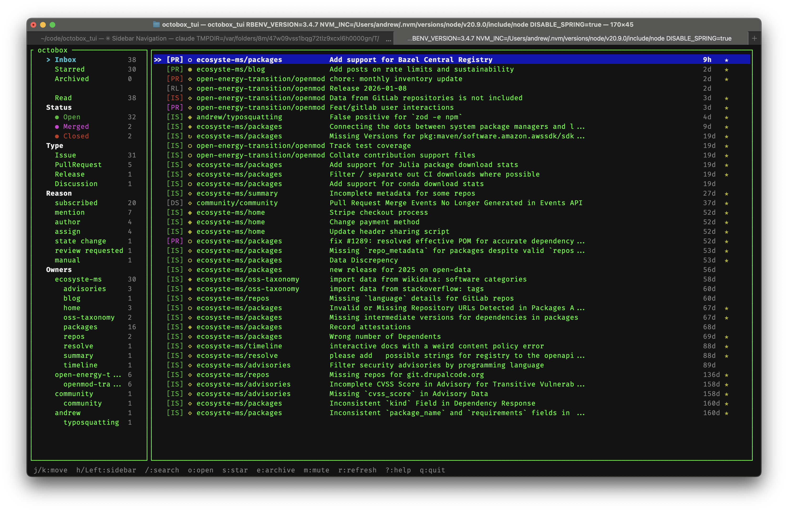

# octobox_tui

A terminal UI for [Octobox](https://octobox.io) notifications.



## Installation

```bash
gem install octobox_tui
```

Or clone and run locally:

```bash
git clone https://github.com/andrew/octobox_tui
cd octobox_tui
bundle install
bundle exec exe/octobox_tui
```

## Configuration

Get your API token from your Octobox settings page (https://octobox.io/settings).

On first run, you'll be prompted to enter your token. It's saved to `~/.octobox_tui/token`.

You can also set these environment variables:

- `OCTOBOX_API_TOKEN` - your API token
- `OCTOBOX_URL` - Octobox instance URL (default: https://octobox.io)
- `OCTOBOX_TUI_DATA_DIR` - data directory (default: ~/.octobox_tui)

## Keybindings

### Navigation

| Key | Action |
|-----|--------|
| `j` / `Down` | Move down |
| `k` / `Up` | Move up |
| `g` | Go to first |
| `G` | Go to last |
| `h` / `Left` | Focus sidebar |
| `l` / `Right` | Focus list |
| `Enter` | Select sidebar filter |

### Actions

| Key | Action |
|-----|--------|
| `o` / `Enter` | Open in browser |
| `s` | Star/unstar |
| `e` | Archive/unarchive |
| `m` | Mute |
| `r` | Refresh from Octobox |
| `/` | Search |
| `Esc` | Clear filter/search |
| `?` | Help |
| `q` | Quit |

